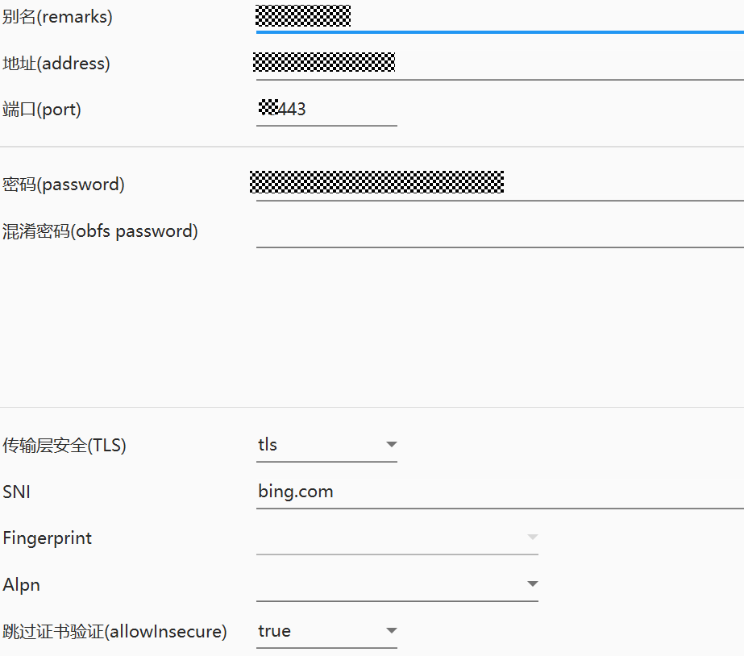

# alpine-hysteria2
在alpine中安装hysteria2

一键食用
```
wget -O install.sh https://raw.githubusercontent.com/zrlhk/alpine-hysteria2/main/install.sh --no-check-certificate && sh install.sh
```
重复执行，会覆盖密码。

说明：
配置文件：/etc/hysteria/config.yaml
使用自签名证书，默认端口40442，安全tls，SNI为： bing.com
随系统自启动
看状态 service hysteria status
重启 service hysteria restart

测试环境：  alpine 3.19.1

hy2官方：
https://github.com/apernet/hysteria




